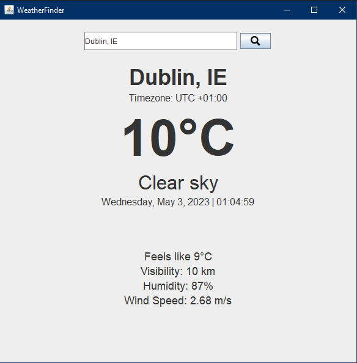
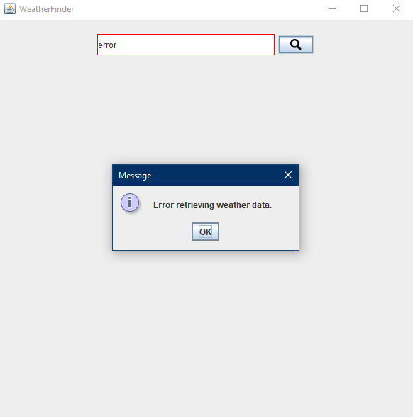

# WeatherFinder App

A desktop application to easily search for weather information for any location! Built using Java Swing and powered by the OpenWeatherMap API, this app offers a simple and efficient way to retrieve the latest weather data.

## Features

- View the current temperature, weather summary, feels-like temperature, humidity, wind speed, visibility, and timezone information for any location you search.
- Plus, the app has built-in error handling to ensure that you receive accurate information every time.

<table>
  <tr>
    <td></td>
     <td><video src="res/WeatherFinder.mp4" controls width="300"></video></td>
    <td></td>
  </tr>
</table>

## Prerequisites
- Getting started is easy! All you need is:
- Java Development Kit (JDK) 8 or higher
- OpenWeatherMap API key (sign up for a free account [here](https://home.openweathermap.org/users/sign_up))

## Installation and Setup

1. Clone this repository: `git clone https://github.com/joelmarodrigues/weatherApp_project.git`
2. Open the project in your preferred Java IDE
3. Replace `API_KEY` in `WeatherApp.java` with your OpenWeatherMap API key
4. Run the `WeatherApp.java` file to start the application

## Usage

1. Enter a location in the search field and click the magnifying glass button or press Enter
2. If the location is found, the weather information will be displayed in the middle and bottom panels
3. If the location is not found or there is an error retrieving weather data, an error message will be displayed and the search field border will turn red
4. To search for weather information for another location, clear the search field and enter a new location

## Resources
- To learn more about:
- [Java Swing Tutorial - How to Create a GUI Application in Java](https://www.guru99.com/java-swing-gui.html) by James Hartman on Guru99
- [Java Swing UI - Synthetica Paid Premium Look and Feel Test](https://www.youtube.com/watch?v=He-1O8Pa4SE&t=44s) by KeepToo on YouTube
- [GUI in Java [Complete Practical Guide]](https://iq.opengenus.org/gui-in-java/) by Abhijeet Saroha on OpenGenus IQ

## License

This project is licensed under the MIT License. See the [LICENSE](LICENSE) file for details.

-Get started today and never be caught off guard by the weather again!
